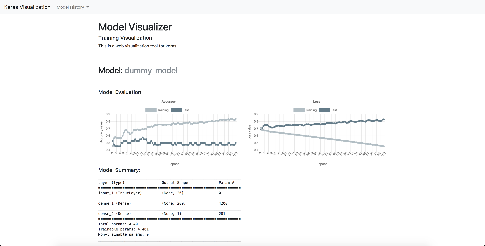

# Visualization #

A web visualization tool for overviewing the iterative training of machine learning models in keras! Edit
Add topics

## Example Screenshot

## Installation

For now clone the repository,
`git clone https://github.com/DylanModesitt/keras-visualization.git`

## Usage

Simply use the `RemoteMonitor` keras callback from the package and configure it with the root url and other optional params.
`remote = RemoteMonitor(root='http://localhost:9000')` and add it with a callback during `model.fit` with `callbacks=[remote]`

Then run `python api.py` and you should be good to go to start running your training scripts. 

You can see that models are saved in the data directory of the package. You can delete on of these models if you would no longer like to display it.

